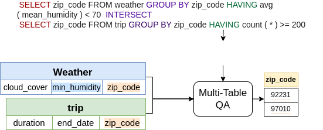
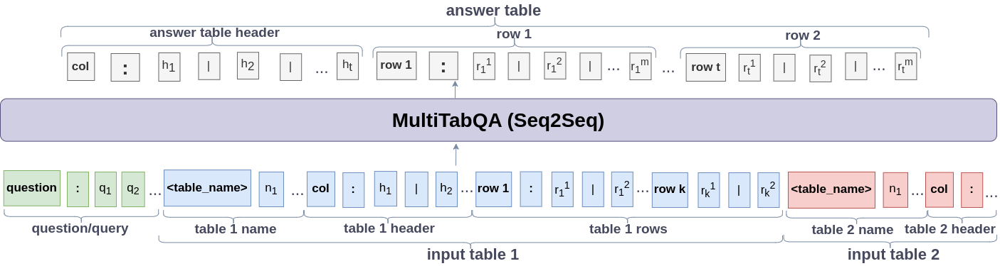
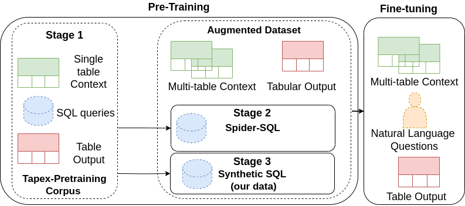

# MultiTabQA: Generating Tabular Answers for Multi-Table Question Answering




Details of dataset generation and results can be found in our [paper](https://arxiv.org/abs/2305.12820).

Finetuning datasets present in data directory:

Datasets present in data directory:
1. geoquery: Natural questions, context tables, and target table of GeoQuery for multi-table QA
2. atis:  Natural questions, context tables, and target table  of Atis for multi-table QA
3. data.txt: contains url to download all data. The zip file contains Tapex single-table pre-training data, Multi-Table pre-training data, spider dataset where each sample is comprised of the natural question/SQL query, context table/(s), and target table  for multi-table QA.

+ **keys in datasets**:  
    + 'source': flattened input sequence comprising of natural question and context input tables as concatenated string
    + 'target': flattened target table
    
Loading the Spider dataset:
 ```
 from datasets import load_from_disk
 spider_natural_questions_data = load_from_disk(f"data/spider/tokenized_spider_nq_train_with_answer.hf")
 spider_sql_query_data = load_from_disk(f"data/spider/tokenized_spider_sql_train.hf")
 ```
**Model Architecture**


We train a sequence-to-sequence model with backbone architecute `bart-base`. The input sequence is the concatenated question, context tables and output is the flattened answer table.

**Datasets**
The datasets for pretraining and finetuning can be found in the data directory

**Training Process**



+ Pre-training checkpoints can be found at:
    + [Stage 1 + Stage 2 + Stage 3 (Multi-Table pre-training)](https://huggingface.co/vaishali/multitabqa-base-sql)

+ Fine-tuning Natural Question model checkpoints can be found at:
    + [Spider](https://huggingface.co/vaishali/multitabqa-base/)
    + [Atis](https://huggingface.co/vaishali/multitabqa-base-atis)
    + [GeoQuery](https://huggingface.co/vaishali/multitabqa-base-geoquery)
    
Arguments for pre-training:
```
python train.py --dataset_name "multitab_pretraining" 
                --pretrained_model_name "microsoft/tapex-base" \
                --learning_rate 1e-4 --train_batch_size 4 --eval_batch_size 4 \
                --gradient_accumulation_steps 64 --eval_gradient_accumulation 64 \
                --num_train_epochs 60 --use_multiprocessing False \
                --num_workers 2 --decoder_max_length 1024 \
                --local_rank -1  --seed 47 \ 
                --output_dir "experiments/tapex_base_pretraining"
```


Arguments for fine-tuning:
```
python train.py --dataset_name "spider_nq" 
                --pretrained_model_name "experiments/tapex_base_pretraining" \
                --learning_rate 1e-4 --train_batch_size 4 --eval_batch_size 4 \
                --gradient_accumulation_steps 64 --eval_gradient_accumulation 64 \
                --num_train_epochs 60 --use_multiprocessing False \
                --num_workers 2 --decoder_max_length 1024 \
                --local_rank -1  --seed 47 \ 
                --output_dir "experiments/tapex_base_finetuning_on_spiderNQ"
```

To evaluate:
```
python evaluate.py --batch_size 2 \
                   --pretrained_model_name "experiments/tapex_base_finetuning_on_spiderNQ" \
                   --dataset_name "spider_nq"
```
**Results**

Dataset | Model  | Table EM | Row EM (P) |  Row EM (R) |  Row EM (F1) | Column EM (P) |  Column EM (R) |  Column EM (F1)  | Cell EM (P) | Cell EM (R) | Cell EM (F1) 
--------| ------- | ------------| -----------          | -------            | ------------        | -------------           |-----------             | ----------              | --------------        | ---------------    |------------
Spider |tapex-base |18.99 | 17.28 |19.83 | 18.27 | 19.75 | 19.39 | 19.57 | 23.15 | 27.71 | 25.03
| | MultiTabQA | **25.19*** |**22.88†** | **24.64*** | **23.70*** | **26.86*** | **26.76*** | **26.81*** | **28.07†** | **31.23*** | **29.55***
GeoQ |tapex-base | 39.84 |22.43 | 30.74 | 24.89 | 39.48 | 39.76 | 39.62 | 21.98 | 30.88 | 24.67
| | MultiTabQA | **52.22*** | **72.39*** | **46.90*** | **41.38*** | **52.10*** | **52.22*** | **52.16*** | **37.16†** | **46.92*** | **41.33***
Atis |tapex-base | 72.20 | 57.07† | 57.69 | 55.08 | 72.20† | 72.20 | 72.20 | 57.07† | 57.69 | 54.48
| | MultiTabQA | **73.88†** | 38.29 | **92.19*** | 54.36 | 69.55 | **75.24†** | **72.29** | 38.16 | **92.56*** | 54.16

**Citation**

Please cite our work if you use our code or dataset:
```
@misc{pal2023multitabqa,
      title={MultiTabQA: Generating Tabular Answers for Multi-Table Question Answering}, 
      author={Vaishali Pal and Andrew Yates and Evangelos Kanoulas and Maarten de Rijke},
      year={2023},
      eprint={2305.12820},
      archivePrefix={arXiv},
      primaryClass={cs.CL}
}
```
