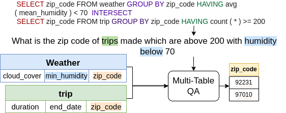

# MultiTabQA: Generating Tabular Answers for Multi-Table Question Answering




Details of dataset generation and results can be found in our [paper](https://arxiv.org/abs/2305.12820).

Finetuning datasets present in data directory:

Datasets present in data directory:
data.txt: contains url to download all data. The zip file contains Tapex single-table pre-training data, Multi-Table pre-training data, spider dataset where each sample is comprised of the natural question/SQL query, context table/(s), and target table  for multi-table QA.

+ **keys in datasets**:  
    + 'source': flattened input sequence comprising of natural question and context input tables as concatenated string
    + 'target': flattened target table

Loading MultiTabQA pretraining data: Spider pretraining dataset (stage 2) and MultiTabQA pretraining dataset (stage 3: Synthetic SQL):
```
from datasets import load_dataset, concatenate_datasets
spider_pretraining = load_dataset("vaishali/spider-tableQA-pretraining")
multitabqa_pretraining = load_dataset("vaishali/multitabqa_pretraining")["train"]
multitabqa_pretraining = multitabqa_pretraining.shuffle()
multitabqa_pretraining_splits = multitabqa_pretraining.train_test_split(0.01)
multitab_pretraining_raw_train = concatenate_datasets([multitabqa_pretraining_splits["train"], spider_pretraining["train"]])
multitab_pretraining_raw_validation = concatenate_datasets([multitabqa_pretraining_splits["test"], spider_pretraining["validation"]])
multitab_pretraining_train_tokenized = multitab_pretraining_raw_train.map(tokenize_sample)
multitab_pretraining_validation_tokenized = multitab_pretraining_raw_validation.map(tokenize_sample)
```
Loading the fine-tuning MultiTabQA datasets:
 ```
 from datasets import load_from_disk, load_dataset
 spider_tableQA = load_dataset("vaishali/spider-tableQA")
 atis_tableQA = load_dataset("vaishali/atis-tableQA")
 geoQuery_tableQA = load_dataset("vaishali/geoQuery-tableQA")
 ```
**Model Architecture**


We train a sequence-to-sequence model with backbone architecute `bart-base`. The input sequence is the concatenated question, context tables and output is the flattened answer table.

**Datasets**
The datasets for pretraining and finetuning can be found in the data directory

**Training Process**


+ Pre-training checkpoints can be found at:
    + [Stage 1 + Stage 2 + Stage 3 (Multi-Table pre-training)](https://huggingface.co/vaishali/multitabqa-base-sql)

+ Fine-tuning Natural Question model checkpoints can be found at:
    + [Spider](https://huggingface.co/vaishali/multitabqa-base/)
    + [Atis](https://huggingface.co/vaishali/multitabqa-base-atis)
    + [GeoQuery](https://huggingface.co/vaishali/multitabqa-base-geoquery)
    
Arguments for pre-training (Stage 1):
```
python train.py --dataset_name "tapex_pretraining" 
                --pretrained_model_name "microsoft/tapex-base" \
                --learning_rate 1e-4 --train_batch_size 4 --eval_batch_size 4 \
                --gradient_accumulation_steps 64 --eval_gradient_accumulation 64 \
                --num_train_epochs 60 --use_multiprocessing False \
                --num_workers 2 --decoder_max_length 1024 \
                --local_rank -1  --seed 47 \ 
                --output_dir "experiments/tapex_base_pretraining"
```

Arguments for pre-training (Stage 2+3):
```
python train.py --dataset_name "multitab_pretraining" 
                --pretrained_model_name "experiments/tapex_base_pretraining" \
                --learning_rate 1e-4 --train_batch_size 4 --eval_batch_size 4 \
                --gradient_accumulation_steps 64 --eval_gradient_accumulation 64 \
                --num_train_epochs 60 --use_multiprocessing False \
                --num_workers 2 --decoder_max_length 1024 \
                --local_rank -1  --seed 47 \ 
                --output_dir "experiments/multitabqa_base_sql"
```

Arguments for fine-tuning:
```
python train.py --dataset_name "spider_nq" 
                --pretrained_model_name "vaishali/multitabqa-base-sql" \
                --learning_rate 1e-4 --train_batch_size 4 --eval_batch_size 4 \
                --gradient_accumulation_steps 64 --eval_gradient_accumulation 64 \
                --num_train_epochs 60 --use_multiprocessing False \
                --num_workers 2 --decoder_max_length 1024 \
                --local_rank -1  --seed 47 \ 
                --output_dir "experiments/tapex_base_finetuning_on_spiderNQ"
```

To evaluate model finetuned on Spider natural langauge questions dataset:
```
python evaluate_multitabqa.py --batch_size 2 \
                   --pretrained_model_name "vaishali/multitabqa-base" \
                   --dataset_name "spider_nq"
```

To evaluate model finetuned on GeoQuery natural langauge questions dataset:
```
python evaluate_multitabqa.py --batch_size 2 \
                   --pretrained_model_name "vaishali/multitabqa-base-geoquery" \
                   --dataset_name "geo_test"
```

**Results**

Dataset | Model  | Table EM | Row EM (P) |  Row EM (R) |  Row EM (F1) | Column EM (P) |  Column EM (R) |  Column EM (F1)  | Cell EM (P) | Cell EM (R) | Cell EM (F1) 
--------| ------- | ------------| -----------          | -------            | ------------        | -------------           |-----------             | ----------              | --------------        | ---------------    |------------
Spider |tapex-base |18.99 | 17.28 |19.83 | 18.27 | 19.75 | 19.39 | 19.57 | 23.15 | 27.71 | 25.03
| | MultiTabQA | **25.19*** |**22.88†** | **24.64*** | **23.70*** | **26.86*** | **26.76*** | **26.81*** | **28.07†** | **31.23*** | **29.55***
GeoQ |tapex-base | 39.84 |22.43 | 30.74 | 24.89 | 39.48 | 39.76 | 39.62 | 21.98 | 30.88 | 24.67
| | MultiTabQA | **52.22*** | **72.39*** | **46.90*** | **41.38*** | **52.10*** | **52.22*** | **52.16*** | **37.16†** | **46.92*** | **41.33***
Atis |tapex-base | 72.20 | 57.07† | 57.69 | 55.08 | 72.20† | 72.20 | 72.20 | 57.07† | 57.69 | 54.48
| | MultiTabQA | **73.88†** | 38.29 | **92.19*** | 54.36 | 69.55 | **75.24†** | **72.29** | 38.16 | **92.56*** | 54.16

**Citation**

Please cite our work if you use our code or dataset:
```
@inproceedings{pal-etal-2023-multitabqa,
    title = "{M}ulti{T}ab{QA}: Generating Tabular Answers for Multi-Table Question Answering",
    author = "Pal, Vaishali  and
      Yates, Andrew  and
      Kanoulas, Evangelos  and
      de Rijke, Maarten",
    booktitle = "Proceedings of the 61st Annual Meeting of the Association for Computational Linguistics (Volume 1: Long Papers)",
    month = jul,
    year = "2023",
    address = "Toronto, Canada",
    publisher = "Association for Computational Linguistics",
    url = "https://aclanthology.org/2023.acl-long.348",
    doi = "10.18653/v1/2023.acl-long.348",
    pages = "6322--6334",
    abstract = "Recent advances in tabular question answering (QA) with large language models are constrained in their coverage and only answer questions over a single table. However, real-world queries are complex in nature, often over multiple tables in a relational database or web page. Single table questions do not involve common table operations such as set operations, Cartesian products (joins), or nested queries. Furthermore, multi-table operations often result in a tabular output, which necessitates table generation capabilities of tabular QA models. To fill this gap, we propose a new task of answering questions over multiple tables. Our model, MultiTabQA, not only answers questions over multiple tables, but also generalizes to generate tabular answers. To enable effective training, we build a pre-training dataset comprising of 132,645 SQL queries and tabular answers. Further, we evaluate the generated tables by introducing table-specific metrics of varying strictness assessing various levels of granularity of the table structure. MultiTabQA outperforms state-of-the-art single table QA models adapted to a multi-table QA setting by finetuning on three datasets: Spider, Atis and GeoQuery.",
}
```
